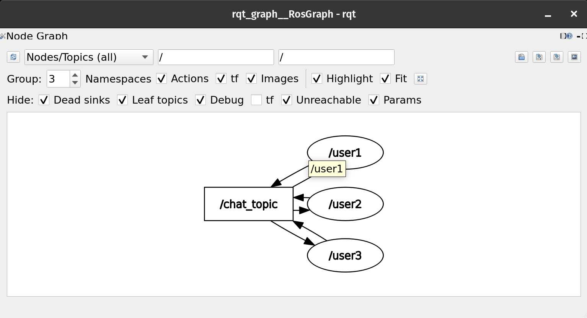

# ROS2 Multi-User Chatroom System

Welcome to the ROS2 Multi-User Chatroom System! This project is a labor of love and ingenuity—designed to bring real-time communication to life using the power of ROS2. Whether you're a robotics enthusiast or just curious about distributed systems, this chatroom is our little experiment in creating seamless communication between multiple users.

---

## Description of the Task

Imagine a room where every user has a voice, and every message is heard by everyone present. Our goal was to build a chatroom system where multiple users, each running their own ROS2 node, can communicate in real time. Initially, we wanted to get fancy with both public messages (broadcast to everyone) and private messages (sent directly via services). However, we ran into some frustrating XML configuration errors—errors like:

- "Packages installing interfaces must include `<member_of_group>rosidl_interface_packages</member_of_group>` in their package.xml"
- Redundant dependency warnings due to mixing generic `<depend>` tags with specific `<build_depend>` and `<exec_depend>` tags.

These build hurdles steered us away from our original plan. In the end, we chose a simpler, more robust solution: a pure topics-based communication system. Now, every user node both sends and receives messages on a shared topic, creating a vibrant, all-hands-on-deck chatroom.

---

## Approach Undertaken

We started with an ambitious plan: combine topics and services to handle both public and private messages. However, the build configuration became a maze of dependency issues in our package.xml file. After many trials (and a few sleepless nights debugging XML errors), we made a heartfelt decision to simplify.

Our final approach uses only topics. Every node publishes its messages on a common channel and listens to that channel too. This way, when user1 speaks, all other users see “user1 said: …”, while the speaker gets a personal confirmation saying “You said: …”. This method is straightforward, reliable, and perfectly suits our real-time chatroom vision.

---

## ROS Topics Published

- **/chat_topic**  
  - **Message Type:** `std_msgs/msg/String`  
  - **Purpose:** This is the heartbeat of our chatroom. Every message sent by any user is published here, ensuring that all nodes (users) receive the message instantly.

---

## ROS Messages and Services Used

- **std_msgs/msg/String**  
  - We rely on this standard ROS2 message type to carry our text messages. Although we flirted with the idea of using custom services for private messages, our journey led us to embrace the simplicity of topics for all communication.

---

## RQT Graph

Our communication network is visualized with rqt_graph. Below is a placeholder image that represents the network of our chat nodes.

To see your own live version, launch rqt_graph in a terminal:

Curious to see it in action? Watch our screen-recorded demo on YouTube and witness the chatroom coming to life:
[YouTube Demo Video](https://youtu.be/ujJOBYQcEwc)